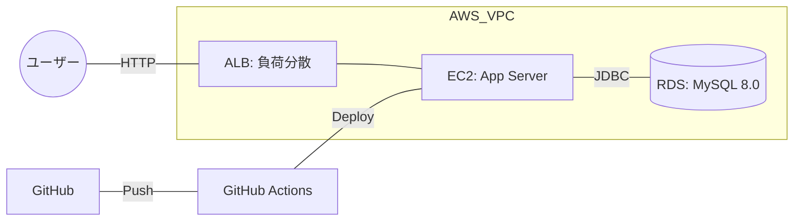
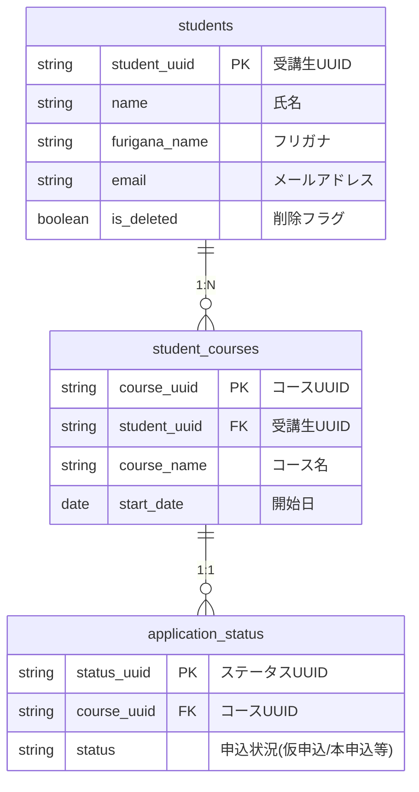

# 受講生管理システム (Student Management System)🎓

##  1. サービス概要 📝

ITスクールの受講生情報を効率的に保持・照会するための管理システムです。
**MyBatisによる動的SQL**を活用した柔軟な検索エンジンと、**AWS（ALB/EC2/RDS）**を用いた可用性の高いインフラ構成を、GitHub ActionsによるCI/CDパイプラインで構築しました。

---

##  2. デモサイト・APIドキュメント 🔗 

### (1)ユーザー操作画面 (Frontend) 🎨
**[👉 システムにアクセスして動作を確認する](http://StudentManagementALB-1209990620.ap-northeast-1.elb.amazonaws.com/)**

http://StudentManagementALB-1209990620.ap-northeast-1.elb.amazonaws.com/
- **ログイン情報**: 認証なしでどなたでも自由にご覧いただけます。

### (2)API仕様書 (Backend / Swagger UI) 📖
**[👉 Swagger UI でAPIの挙動を確認する](http://studentmanagementalb-1209990620.ap-northeast-1.elb.amazonaws.com/swagger-ui/index.html)**

http://studentmanagementalb-1209990620.ap-northeast-1.elb.amazonaws.com/swagger-ui/index.html
- **実機テスト機能**: 「Try it out」から実際に稼働しているAPIに対して検索リクエストを送信し、レスポンス内容を確認できます。

---

##  3. システム機能とAPI定義 ⚙️

デモサイトのトップ画面と、Swagger UIに実装されているAPIの対応関係を整理しています。
| カテゴリ | 機能内容 | 技術的ポイント | 対応API (Swagger) |
| :--- | :--- | :--- | :--- |
| **受講生一覧・検索** | 名前・IDによる動的フィルタリング | **MyBatis動的SQL**。一文字のあいまい検索や複数条件の組み合わせに対応。 | `GET /studentList`, `GET /studentSearch` |
| **受講生情報の更新** | 既存データのセキュアな編集 | 特定IDに対する安全なデータ上書き処理。 | `PUT /updateStudent` |
| **新規受講生登録** | 受講生とコースの新規保存 | ユーザー利便性を考慮したUI/UX設計と、将来的な登録機能への拡張性。 | `POST /registerStudent` |
| **APIドキュメント** | インターフェースの自動可視化 | OpenAPI 3.0準拠。開発効率を高めるドキュメント駆動設計。 | `/swagger-ui/index.html` |
### (1) 受講生一覧・検索
登録されている受講生の情報を検索し、詳細を確認できる機能です。
- **画面上の操作**: 「一覧を開く」からリストを表示。検索窓でID（完全一致）や名前（部分一致）によるフィルタリングが可能です。
- **対応API**: `GET /studentList`, `GET /studentSearch`
- **実装技術**: **MyBatis動的SQL**。IDや名前の入力状況（どちらか片方、両方、または無入力）に応じて、`<where>` や `<if>` タグを用いて最適なクエリを動的に生成します。

### (2) 受講生情報の更新
既存の受講生データを最新の状態へ書き換える機能です。
- **機能概要**: 受講生の登録情報を変更し、データベースに反映させます。
- **対応API**: `PUT /updateStudent`
- **実装**: `{studentUuid}` をキーに、リクエストボディで送られたデータを用いてレコードを更新します。

### (3) 新規受講生登録
新しい受講生とコース情報をシステムに登録する機能です。
- **画面上の操作**: 「新規作成」ボタンから登録用フォームへ遷移します。
- **対応API**: `POST /registerStudent`
- **実装**: フロントエンドのフォームから送信された受講生情報とコース情報を紐付け、一貫性を保ちながらデータベースへ保存します。

  
---

##  4. インフラ構成・システム設計 🏗

### (1) インフラ構成図 (AWS)
実務レベルの可用性を確保するため、ALB（負荷分散）とRDS（DB分離）を組み合わせた構成です。

### (2) データベース設計 (ER図)
students（受講生基本情報）、student_courses（受講コース）、application_status（申込ステータス）の3層構造で管理しています。

---

## 5. 技術的な注力点 💡

* **MyBatisによる柔軟な検索ロジック**
    `GET /studentSearch` において、IDや名前の入力有無を `<if>` タグで判定。どのような検索パターンの組み合わせ（片方のみ、両方、または無入力）でも、常に最適かつ高速なSQLを発行する設計を徹底しました。

* **実務的な運用設計**
    AWS EC2上で `systemd` によるプロセス管理を行い、OS再起動や不測の停止時も自動的に復旧する「止まらないシステム」を構築。可用性を意識したサーバーサイド設計を行っています。

* **CI/CDの完全自動化**
    GitHub Actionsを導入し、`main` ブランチへのPushから本番反映までを完全自動化。手作業によるデプロイ事故を排除し、安全でスピーディーなリリースサイクルを実現しました。
